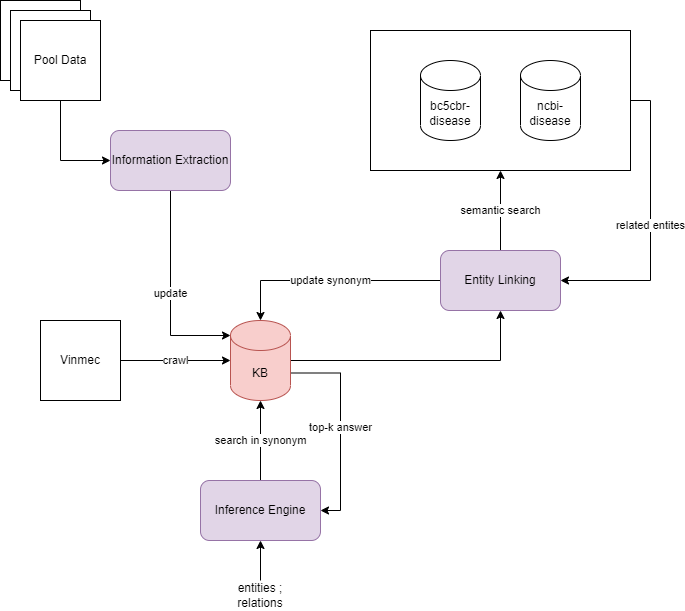

# Vietnamese healthcare Knowledge Base System

The system would be as following



## Installation

Clone this repo and install the dependencies:

```bash
git clone https://github.com/phamnam-mta/symptom-checker.git
cd know-life
pip install -r requirements.txt
```
## Prepare data:
Download data from [here](https://drive.google.com/file/d/1WBmAnu-pC5FB3BHoPoVsKlFDm2S-QbZa/view?usp=sharing) and unzip file to root folder
<!-- 3. Download checkpoint -->

<!-- - Download NER Checkpoint in [here](https://drive.google.com/drive/folders/111ThBNm1B744V5WnsQDU64ou5oAyK9j_?usp=sharing) -->
<!-- Download NLU Checkpoint in [here](https://drive.google.com/drive/folders/1WzkKClA68Ubbl0404dN1KPeKPPkZnufB?usp=sharing)

- Copy downloaded checkpoint into `./ckpt` folder -->
## Run Know-life service locally

```bash
python ./src/run.py
```
## Run Know-life service with docker
```bash
# build Know-life service
docker build -t know_life .

# run Know-life service
docker run --name app -d -p 5000:5000 know_life

# stop Know-life service
docker stop app
```
## Usage:

```python
import requests
url = 'http://0.0.0.0:5000/medical_test_suggestion'
results = requests.post(url, json={ "indicators": [ { "id": 1, "test_name": "Cholesterol toàn phần", "result": 6.60, "unit": "mmol/L" }, { "id": 2, "test_name": "Protein niệu", "result": "âm tính"} ] })

print(results.json())
```
