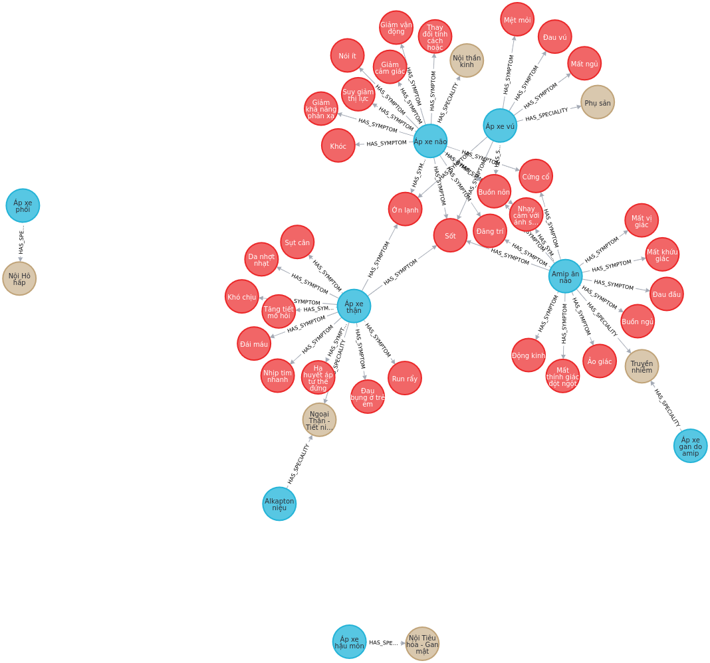

## Installation
1. Package
```
pip install py2neo
```
2. Connect with Neo4j Desktop
- Download in here
- Create a new DBMS database with password == "password"
- Install APOC Plugin (Click on created DB -> Plugin -> Install APOC)
3. Import data into Neo4j
```
cd neo4j 
Go to notebook build_graphdb.ipynb
Then run these code:
kg = KnowledgeGraph()
kg.create_node()
kg.create_rels()
```

## Usage

```
inferencer = Inferencer()

request = {
    'symptom': ['phân có máu','sốt','chóng mặt','buồn nôn','đau ngực'],
    'disease': ['trĩ ngoại'],
    'intent' : 'verify'
}
answer = inferencer.query(request)


[[{'disease': 'Trĩ ngoại', 'symptom': 'Máu trong phân', 'relation': False}, {'disease': 'Trĩ ngoại', 'symptom': 'Phân có máu', 'relation': True}], [{'disease': 'Trĩ ngoại', 'symptom': 'Sốt cao', 'relation': False}, {'disease': 'Trĩ ngoại', 'symptom': 'Sốt nhẹ', 'relation': False}]
```

TODO:
- treatment for symptoms